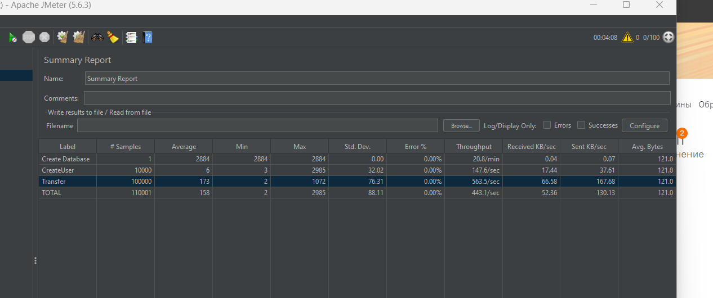
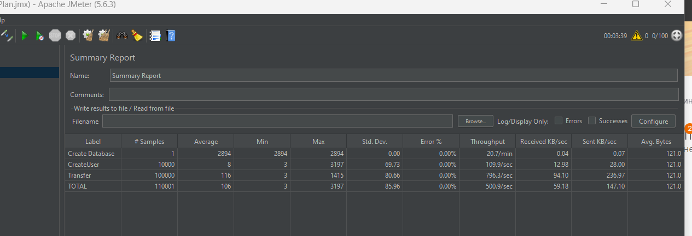
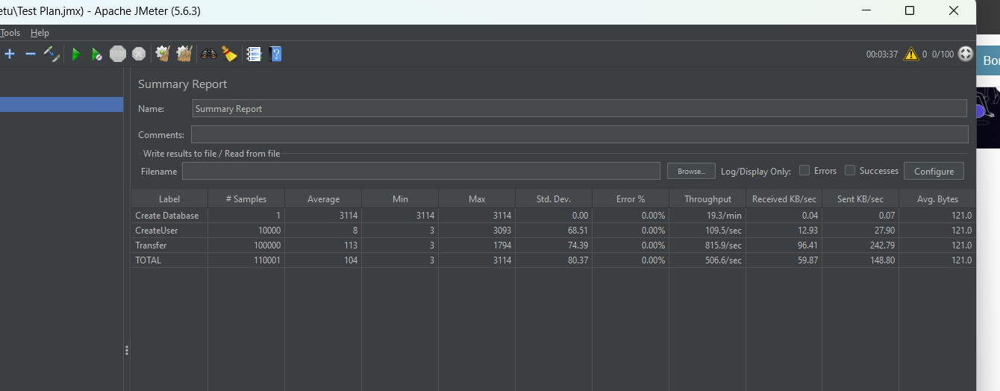
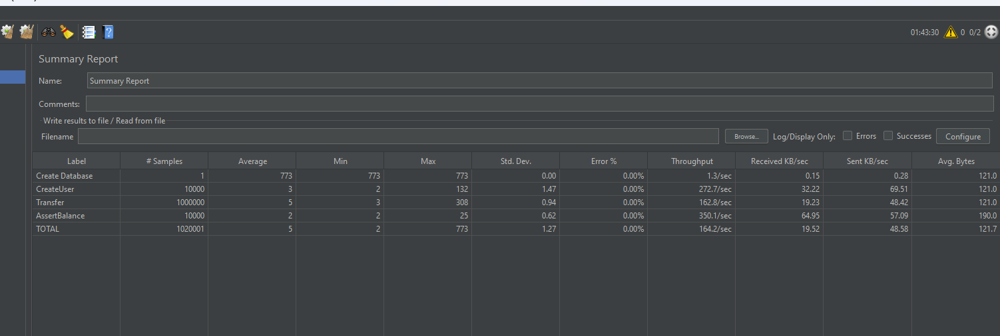

Проект для демонстрации методов оптимизации высоконагруженных приложений.  
В качестве высоконагруженного приложения будет система банковских транзакций.  
Первая часть проекта состоит из простого консольного приложения, которое будет генерировать тестовые транзакции,
которыми мы в последствии будем нагружать наше приложение.

цель проекта не сделать blazingly fast single instance, а добиться приближения к линейному росту производительности при горизонтальном масштабировании
можно было сделать проект на сях, который в single instance прорывал 300к rps, но при масшабировании до 10 инстансов деградировал или показывал ущербный рост.

В какой-то момент мы начинаем выпадать с FATAL:  sorry, too many clients already  
решаем с pgbouncer и меняем авторизацию бд на md5

Начинаем скейлить и понимаем, что не можем юзать несколько инстансов на одном порту, ставим nginx как балансировщик  

Первый тест: с 2 репликами

Второй: с 6 репликами

Третий: Снимаем лимиты бд  
как видим упора в бд еще нет

Добавил assertions для баланса
